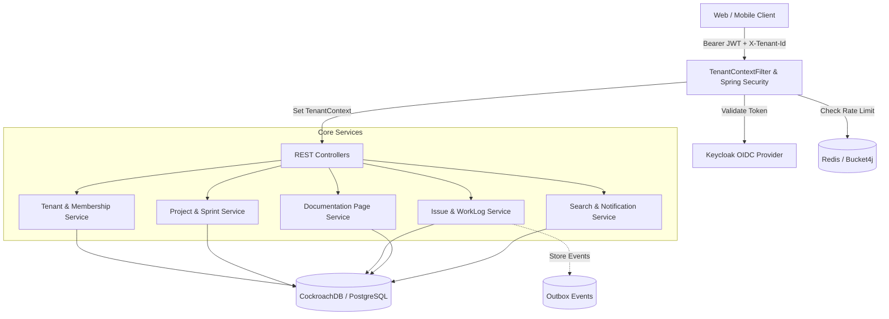

# TaskForge

TaskForge is a production-grade, multi-tenant project and issue tracking SaaS backend built with Spring Boot 3, Java 21, and PostgreSQL/CockroachDB. It delivers strict tenant isolation, role-based access control (RBAC), agile sprint management, hierarchical documentation pages, transactional event outbox messaging, distributed caching, and rate limiting.

## Overview

TaskForge provides the core backend services for enterprise project management and agile team collaboration.

- **What it does:** Powers multi-tenant issue tracking, sprint cycles, nested project documentation pages, user invitations, notifications, full-text search, and activity history.
- **The problem it solves:** Delivers a secure, isolated workspace environment where organizations can manage complex software development lifecycles without data bleed between tenants.
- **Who it is intended for:** Engineering teams, product managers, and organizations requiring high-performance, compliant, multi-tenant task and project management infrastructure.
- **Main value:** Out-of-the-box multi-tenancy, OAuth2/OIDC integration with Keycloak, schema versioning with Flyway, and Redis-backed rate limiting with Bucket4j.

## Features

### Multi-Tenancy & Access Control
- **Shared-Database, Tenant-Isolated Architecture:** All entities are scoped by `tenant_id` resolved directly from Keycloak JWT claims (`tenant_id`) or verified via `X-Tenant-Id` header against database memberships.
- **Tenant & Member Management:** Provision new tenants, invite collaborators via signed invitation tokens with email expiry, manage membership roles (`OWNER`, `ADMIN`, `MEMBER`), and revoke invitations.
- **Project-Level RBAC:** Project-scoped access roles (`MANAGER`, `CONTRIBUTOR`, `VIEWER`) regulating board and issue access.

### Project & Agile Issue Tracking
- **Project Workspaces:** Manage projects with custom keys, project metadata, member assignments, and project insights.
- **Issue Management:** Full lifecycle support for `TASK`, `BUG`, and `STORY` issue types with statuses (`TODO`, `IN_PROGRESS`, `DONE`), priorities (`LOW`, `MEDIUM`, `HIGH`, `CRITICAL`), parent-child issue nesting, and board custom sort ordering.
- **Sprint Management:** Create, update, start, and complete sprints (`PLANNED`, `ACTIVE`, `COMPLETED`) mapped to project boards.
- **Issue Details & Collaboration:** Threaded comments, story point estimations, work log tracking (time spent and dates), activity streams, and granular field audit history.

### Documentation & Knowledge Sharing
- **Project Documentation (Pages):** Nested, hierarchical documentation pages attached to projects with parent-child page trees and icon metadata.

### Infrastructure & Platform Services
- **Global & Scoped Search:** Multi-entity search across projects, issues, pages, and sprints.
- **In-App Notifications:** Real-time user notifications, unread counts, and bulk read operations.
- **Transactional Outbox Pattern:** Outbox events table for consistent asynchronous event publishing across aggregates without distributed transactions.
- **Distributed Rate Limiting:** Endpoint protection via Bucket4j and Redis token buckets (e.g., auth login rate limits and general API rate limits).
- **Interactive OpenAPI 3 / Swagger Documentation:** Swagger UI with PKCE OAuth2 and Bearer token support.

## Architecture

TaskForge implements a layered architecture leveraging Spring Security as an OAuth2 Resource Server and a thread-local context for tenant resolution.



## Technology Stack

| Layer | Technology | Purpose |
| :--- | :--- | :--- |
| **Backend Language** | Java 21 | Core programming language |
| **Framework** | Spring Boot 3.4.12 | REST APIs, dependency injection, and application lifecycle |
| **Persistence / ORM** | Spring Data JPA / Hibernate | Object-relational mapping and database access |
| **Database** | CockroachDB / PostgreSQL | Distributed SQL database with relational integrity |
| **Database Migrations** | Flyway | Automated database schema versioning and migrations |
| **Identity & Access** | Keycloak (OAuth2 / OIDC) | Centralized authentication, user management, and token issuance |
| **Security** | Spring Security 6 (Resource Server) | JWT token validation, method security, and CORS policies |
| **Caching & Rate Limiting** | Redis & Bucket4j (Jedis) | Distributed token bucket rate limiting and caching |
| **Messaging & Mail** | Spring AMQP (RabbitMQ) & Spring Mail | Event-driven infrastructure and invitation emails |
| **API Documentation** | Springdoc OpenAPI (Swagger UI 2.7.0) | Interactive API exploration and OpenAPI 3 schema generation |
| **Build Tool** | Apache Maven (Maven Wrapper) | Dependency management and build automation |

## Project Structure

```text
TaskForge/
├── .mvn/                     # Maven wrapper configuration
├── config/
│   └── keycloak/             # Keycloak realm, client, and user export definitions
│       ├── keycloak-realm-all.json
│       ├── realm-export.json
│       └── clients-export.json
├── docker-compose.yaml       # Container definitions for Keycloak and Redis
├── pom.xml                   # Maven dependencies and build plugins
├── scripts/
│   ├── setup_keycloak.sh     # Automated Keycloak realm configuration script
│   └── verify_rate_limit.sh  # Script to test and verify Bucket4j rate limits
└── src/
    ├── main/
    │   ├── java/com/taskforge/
    │   │   ├── common/       # Cross-cutting security, tenant context, and base models
    │   │   ├── config/       # OpenAPI and Cache configurations
    │   │   ├── issue/        # Issue tracking, comments, work logs, and history
    │   │   ├── membership/   # Tenant and project membership entities
    │   │   ├── notification/ # In-app notification domain
    │   │   ├── page/         # Nested project documentation pages
    │   │   ├── project/      # Project management and analytics
    │   │   ├── search/       # Multi-entity search service
    │   │   ├── sprint/       # Agile sprint management
    │   │   ├── tenant/       # Multi-tenant provisioning and invitation workflows
    │   │   ├── user/         # User profile synchronization and current-user endpoints
    │   │   └── TaskForgeApplication.java
    │   └── resources/
    │       ├── application.yaml # Application configuration and rate limit rules
    │       └── db/migration/    # Flyway SQL migration scripts
    └── test/                 # Integration and unit tests
```

## Getting Started

### Prerequisites

- **Java Development Kit (JDK) 21** or later
- **Docker & Docker Compose**
- **CockroachDB** (local binary or Docker container)

### Installation

1. Clone the repository:
   ```bash
   git clone https://github.com/shaikh-athar/TaskForge.git
   cd TaskForge
   ```

2. Make Maven wrapper executable (Unix / macOS):
   ```bash
   chmod +x mvnw
   ```

### Infrastructure Setup

#### 1. Start Keycloak and Redis
Run the pre-configured Docker Compose stack:
```bash
docker-compose up -d
```
- **Keycloak Admin Console:** [http://localhost:10091](http://localhost:10091) (Default credentials: `admin` / `admin`)
- **Redis:** Running on `localhost:6379`

#### 2. Start CockroachDB
Start a single-node CockroachDB instance:

```bash
# Start local node
cockroach start-single-node \
  --insecure \
  --listen-addr=localhost:26257 \
  --http-addr=localhost:9090 \
  --background

# Create the application database
cockroach sql --insecure --execute="CREATE DATABASE taskforge;"
```

*Alternatively, using Docker:*
```bash
docker run -d \
  --name=taskforge-roach \
  -p 26257:26257 \
  -p 9090:8080 \
  cockroachdb/cockroach:latest \
  start-single-node --insecure
```

### Configuration

Application configuration is maintained in [`src/main/resources/application.yaml`](file:///Users/ayaz/TaskForge/src/main/resources/application.yaml).

Key environment variables:
| Variable | Description | Default / Example |
| :--- | :--- | :--- |
| `MAIL_USERNAME` | SMTP username for outbound invitation emails | *Optional for local testing* |
| `MAIL_PASSWORD` | SMTP password or App Password for outbound emails | *Optional for local testing* |

### Running the Project

Start the application with the Maven wrapper:
```bash
./mvnw spring-boot:run
```

The application will start on **port 8081**:
- **Base API URL:** `http://localhost:8081/api/v1`
- **Swagger UI:** `http://localhost:8081/swagger-ui.html`
- **OpenAPI JSON Spec:** `http://localhost:8081/v3/api-docs`

### Build

To compile and package the project into a standalone JAR:
```bash
./mvnw clean package
```

### Testing

Run the test suite using Maven:
```bash
./mvnw test
```

To run tests with specific configurations:
```bash
./mvnw test -Dspring.profiles.active=test
```

## Usage

### Authentication & Tenant Resolution

All API requests under `/api/v1/**` (except public documentation endpoints) require a valid OAuth2 Bearer Token issued by Keycloak:

```bash
curl -X GET http://localhost:8081/api/v1/projects \
  -H "Authorization: Bearer <KEYCLOAK_JWT_TOKEN>" \
  -H "X-Tenant-Id: <TENANT_UUID>"
```

> **Note:** If the Keycloak JWT token includes a `tenant_id` claim, the `X-Tenant-Id` header check is automatically satisfied. If `tenant_id` is supplied via header, the `TenantContextFilter` verifies that the user is an active member of that tenant before processing the request.

### Verifying Rate Limiting

The application includes an automated test script to verify Bucket4j rate limits on auth endpoints:
```bash
chmod +x scripts/verify_rate_limit.sh
./scripts/verify_rate_limit.sh
```

## API Overview

The backend exposes RESTful endpoints grouped by domain:

### 1. Tenant & Invitations (`/api/v1/tenants`, `/api/v1/invitations`)
- `POST /api/v1/tenants` — Create a new organization tenant.
- `GET /api/v1/tenants` — List tenants the authenticated user belongs to.
- `GET /api/v1/tenants/{tenantId}` — Get tenant details.
- `PUT /api/v1/tenants/{tenantId}` — Update tenant settings.
- `GET /api/v1/tenants/{tenantId}/members` — List members within a tenant.
- `POST /api/v1/tenants/{tenantId}/members` — Send invitation to join tenant.
- `DELETE /api/v1/tenants/{tenantId}/members/{userId}` — Remove a member from the tenant.
- `GET /api/v1/invitations/{token}` — Get invitation details.
- `POST /api/v1/invitations/accept` — Accept invitation via token.
- `DELETE /api/v1/invitations/{invitationId}` — Revoke an invitation.

### 2. Projects (`/api/v1/projects`)
- `GET /api/v1/projects` — List all projects in the active tenant.
- `POST /api/v1/projects` — Create a new project.
- `GET /api/v1/projects/{projectIdOrKey}` — Get project by ID or key.
- `PATCH /api/v1/projects/{projectIdOrKey}` — Update project metadata.
- `DELETE /api/v1/projects/{projectIdOrKey}` — Soft-delete a project.
- `GET /api/v1/projects/{projectIdOrKey}/members` — List project members.
- `POST /api/v1/projects/{projectIdOrKey}/members` — Add member to project.
- `GET /api/v1/projects/{projectIdOrKey}/insights` — Retrieve project analytics.

### 3. Issues & Details (`/api/v1/issues`, `/api/v1/projects/{projectIdOrKey}/issues`)
- `GET /api/v1/issues` — Get all issues for active tenant.
- `GET /api/v1/projects/{projectIdOrKey}/issues` — Get issues for a specific project.
- `GET /api/v1/issues/{issueId}` — Get issue details.
- `GET /api/v1/issues/my` — Get issues assigned to the current user.
- `GET /api/v1/issues/recent` — Get recently updated issues.
- `GET /api/v1/issues/starred` — Get starred issues.
- `POST /api/v1/issues` — Create an issue.
- `PATCH /api/v1/issues/{issueId}` — Update issue details.
- `DELETE /api/v1/issues/{issueId}` — Delete an issue.
- `PUT /api/v1/issues/{issueId}/move` — Reorder / move issue on board.
- `GET /api/v1/issues/{issueId}/comments` & `POST .../comments` — Manage issue comments.
- `GET /api/v1/issues/{issueId}/worklogs` & `POST .../worklogs` — Log work hours.
- `GET /api/v1/issues/{issueId}/history` — Audit trail of issue changes.
- `GET /api/v1/issues/{issueId}/activity` — Combined activity feed.

### 4. Sprints (`/api/v1/projects/{projectIdOrKey}/sprints`, `/api/v1/sprints`)
- `POST /api/v1/projects/{projectIdOrKey}/sprints` — Create a sprint.
- `GET /api/v1/projects/{projectIdOrKey}/sprints` — List sprints for a project.
- `PATCH /api/v1/sprints/{sprintId}` — Update sprint details or status (`PLANNED`, `ACTIVE`, `COMPLETED`).
- `DELETE /api/v1/sprints/{sprintId}` — Delete a sprint.

### 5. Documentation Pages (`/api/v1/projects/{projectIdOrKey}/pages`, `/api/v1/pages`)
- `POST /api/v1/projects/{projectIdOrKey}/pages` — Create documentation page.
- `GET /api/v1/projects/{projectIdOrKey}/pages` — List project documentation pages.
- `GET /api/v1/pages/{pageId}` — Get page content and hierarchy.
- `PATCH /api/v1/pages/{pageId}` — Update page title or content.
- `DELETE /api/v1/pages/{pageId}` — Delete page.

### 6. Notifications & Search (`/api/v1/notifications`, `/api/v1/search`, `/api/v1/me`)
- `GET /api/v1/notifications` — Paginated user notifications.
- `GET /api/v1/notifications/unread-count` — Count unread notifications.
- `PUT /api/v1/notifications/{id}/read` — Mark notification as read.
- `PUT /api/v1/notifications/read-all` — Mark all notifications as read.
- `GET /api/v1/search?q={query}` — Global search across issues, projects, pages, and sprints.
- `GET /api/v1/me` — Current authenticated user profile.
- `GET /api/v1/me/tenants` — List tenants for current user.

## Security

- **Stateless OAuth2 Bearer Authentication:** Verified through Keycloak JWT issuer `http://localhost:10091/realms/taskforge`.
- **Tenant Context Verification:** Every non-exempt request enforces membership validation against the active tenant context.
- **CORS Policies:** Restricts origins to configured client addresses (`http://localhost:3000` by default) with support for credentials and custom headers (`Authorization`, `Content-Type`, `X-Tenant-Id`).
- **Rate Limiting:** Protects endpoints using Redis-backed token buckets configured via Bucket4j in `application.yaml`.

## Development

### Workflow & Conventions
- **Clean Feature Modularity:** Code is organized by domain slice (`issue`, `project`, `sprint`, `tenant`, `page`, `notification`, `search`, `user`).
- **Database Migrations:** Schema modifications must be applied via incremental Flyway scripts in `src/main/resources/db/migration/` (`V1_x__description.sql`).
- **Auditing & Soft Deletion:** Base entity attributes (`createdAt`, `createdBy`, `updatedAt`, `updatedBy`, `deleted`) are managed via `BaseEntity` lifecycle listeners.

## Roadmap

### Implemented
- [x] Multi-tenant isolation and tenant switching
- [x] Keycloak OAuth2 / OIDC authentication and token validation
- [x] Project, issue, and sprint management
- [x] Nested documentation pages
- [x] In-app notification center
- [x] Redis-backed rate limiting (Bucket4j)
- [x] Transactional outbox event schema
- [x] Global multi-entity search

### Planned
- [ ] Outbox publisher worker for RabbitMQ / Kafka event dispatch
- [ ] Webhook subscription system for third-party integrations
- [ ] Advanced full-text search indexing (Elasticsearch / OpenSearch)
- [ ] Real-time WebSocket notifications and live board updates

### Future Ideas
- [ ] AI-assisted issue summarization and sprint estimation
- [ ] Custom workflow engine with configurable status transitions

## Contributing

1. Fork the repository.
2. Create a feature branch (`git checkout -b feature/amazing-feature`).
3. Commit your changes (`git commit -m 'Add some amazing feature'`).
4. Push to the branch (`git push origin feature/amazing-feature`).
5. Open a Pull Request.

## License

This project does not currently specify an open-source license. All rights are reserved by the authors.

## Acknowledgements

- [Spring Boot](https://spring.io/projects/spring-boot)
- [Keycloak](https://www.keycloak.org/)
- [CockroachDB](https://www.cockroachlabs.com/)
- [Bucket4j](https://bucket4j.com/)
- [Flyway](https://flywaydb.org/)
- [Springdoc OpenAPI](https://springdoc.org/)
